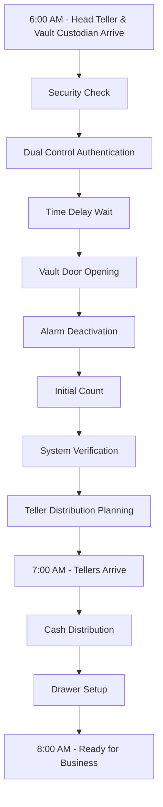
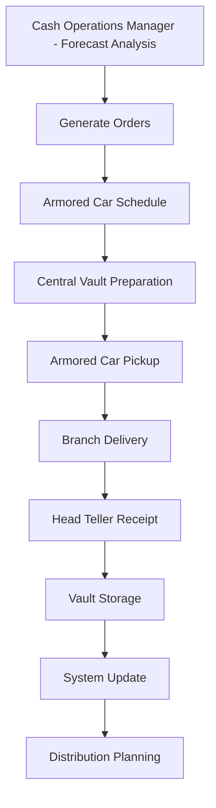
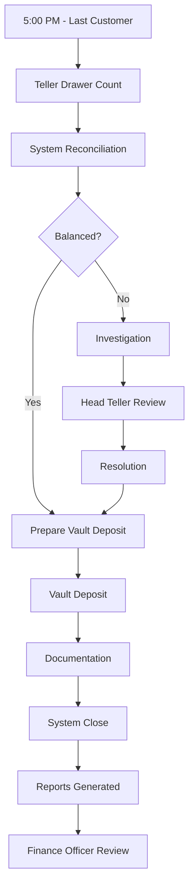
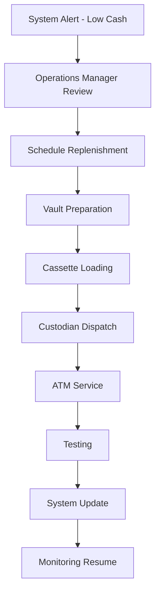

# Cash Management User Journeys & Stories

## Table of Contents

1. [Overview](#overview)
2. [Primary Users](#primary-users)
3. [User Journeys](#user-journeys)
   - [Teller Journey](#1-teller-journey)
   - [Head Teller Journey](#2-head-teller-journey)
   - [Vault Custodian Journey](#3-vault-custodian-journey)
   - [Branch Manager Journey](#4-branch-manager-journey)
   - [Cash Operations Manager Journey](#5-cash-operations-manager-journey)
   - [Member/Customer Journey](#6-membercustomer-journey)
   - [Armored Car Personnel Journey](#7-armored-car-personnel-journey)
   - [ATM Custodian Journey](#8-atm-custodian-journey)
   - [Internal Auditor Journey](#9-internal-auditor-journey)
   - [Finance Officer Journey](#10-finance-officer-journey)
4. [User Stories by Role](#user-stories-by-role)
5. [Cross-Functional Workflows](#cross-functional-workflows)

## Overview

This document maps out complete user journeys and stories for all stakeholders involved in the SACCOS cash management system. Each journey details the daily activities, pain points, system interactions, and success criteria for different user roles.

## Primary Users

### Direct Cash Handlers
- **Tellers** - Front-line cash processing
- **Head Tellers** - Supervisory and vault management
- **Vault Custodians** - Vault security and inventory
- **ATM Custodians** - ATM maintenance and replenishment

### Management & Oversight
- **Branch Managers** - Branch-level oversight
- **Cash Operations Managers** - System-wide cash management
- **Finance Officers** - Financial reporting and reconciliation
- **Internal Auditors** - Compliance and control verification

### External Stakeholders
- **Members/Customers** - End users of cash services
- **Armored Car Personnel** - Cash transportation services

## User Journeys

### 1. Teller Journey

#### Persona: Sarah, Branch Teller
- **Experience**: 2 years in banking
- **Tech Comfort**: Moderate
- **Main Goals**: Accurate transactions, happy customers, balanced drawer

#### Daily Journey Map

**6:30 AM - Pre-Opening Preparation**
```
ARRIVAL → SYSTEM LOGIN → DRAWER SETUP
```
- Arrives 30 minutes before opening
- Logs into teller system with biometric authentication
- Reviews previous day's closing notes
- Checks system notifications for policy updates

**7:00 AM - Morning Cash Setup**
```
VAULT ACCESS → CASH REQUISITION → DRAWER PREPARATION
```
- Accompanies Head Teller to vault (dual control)
- Requests starting cash based on daily forecast
- Counts and verifies denominations received
- Arranges cash in drawer by denomination
- Enters opening balance in system
- Prints and signs opening balance report

**Pain Points:**
- Vault queue during peak morning setup
- System slow to load in the morning
- Denomination mix not always optimal

**7:30 AM - System Verification**
```
BALANCE VERIFICATION → SYSTEM SYNC → READY STATUS
```
- Verifies physical count matches system
- Checks ATM connectivity status
- Reviews scheduled appointments
- Sets status to "Ready for Customers"

**8:00 AM - 12:00 PM - Morning Operations**
```
CUSTOMER SERVICE → TRANSACTION PROCESSING → CONTINUOUS BALANCING
```

**Customer Interaction Flow:**
1. Greet customer and verify identity
2. Process transaction request:
   - **Deposits**: Count cash twice, enter in system, issue receipt
   - **Withdrawals**: Verify balance, count cash twice, obtain approval if needed
   - **Transfers**: Process between accounts, verify details
3. Update system in real-time
4. Provide receipt with transaction details

**Mid-Morning Cash Management (10:00 AM):**
- Check drawer balance against limits
- If approaching limit ($10,000):
  - Prepare excess cash for vault sale
  - Complete cash transfer form
  - Execute dual-control vault deposit
- If running low on specific denominations:
  - Request buy from vault or other teller
  - Document inter-teller transfer

**12:00 PM - 1:00 PM - Lunch Rotation**
```
DRAWER HANDOFF → BREAK → DRAWER RECOVERY
```
- Balance and lock drawer
- Hand over to covering teller (if applicable)
- Document any pending transactions
- Return and re-verify drawer balance

**1:00 PM - 5:00 PM - Afternoon Operations**
```
CONTINUED SERVICE → PEAK MANAGEMENT → PRE-CLOSING PREP
```
- Handle increased afternoon traffic
- Process business deposits (larger amounts)
- Prepare for end-of-day merchants
- Start organizing documentation

**5:00 PM - 5:30 PM - End of Day Balancing**
```
FINAL TRANSACTIONS → DRAWER COUNT → RECONCILIATION
```

**Closing Procedure:**
1. Process last customer at 5:00 PM
2. Run adding machine tape on all checks
3. Count cash by denomination (twice)
4. Enter closing balance in system
5. Print balancing report
6. Investigate any discrepancies:
   - Review transaction logs
   - Check receipt copies
   - Verify system entries
7. Complete outage/overage report if needed
8. Bundle excess cash for vault

**5:30 PM - 6:00 PM - Vault Submission**
```
VAULT DEPOSIT → DOCUMENTATION → SIGNOFF
```
- Accompany Head Teller to vault
- Deposit excess cash with verification
- Sign vault log and obtain receipt
- Secure drawer for next day
- Complete daily activity report
- Log out of all systems

**Success Metrics:**
- Zero balance discrepancies
- Customer satisfaction scores >90%
- Transaction accuracy >99.9%
- Average transaction time <3 minutes

### 2. Head Teller Journey

#### Persona: Michael, Head Teller
- **Experience**: 8 years, promoted from Teller
- **Tech Comfort**: High
- **Main Goals**: Team efficiency, vault security, regulatory compliance

#### Daily Journey Map

**6:00 AM - Opening Leadership**
```
EARLY ARRIVAL → VAULT INSPECTION → TEAM PREPARATION
```
- First to arrive, disarms alarms
- Inspects vault area for security
- Reviews overnight reports and alerts
- Prepares daily cash forecast
- Prints teller assignments

**6:30 AM - Vault Opening**
```
DUAL CONTROL → VAULT ACCESS → INVENTORY CHECK
```
- Meets with Vault Custodian
- Executes dual-control vault opening
- Verifies overnight balance
- Reviews denomination inventory
- Plans distribution strategy

**7:00 AM - Teller Cash Distribution**
```
REQUISITION PROCESSING → CASH PREPARATION → DISTRIBUTION
```
- Processes teller cash requests
- Prepares cash bundles by teller
- Supervises distribution with verification
- Updates vault inventory system
- Documents all movements

**8:00 AM - 12:00 PM - Operational Oversight**
```
MONITORING → SUPPORT → PROBLEM RESOLUTION
```

**Continuous Activities:**
- Monitor teller queues on dashboard
- Approve large transactions (>$10,000)
- Handle escalated customer issues
- Process vault buys/sells from tellers
- Coordinate with Branch Manager

**Special Situations:**
- **Cash Delivery Arrival (10:00 AM):**
  - Verify armored car credentials
  - Execute dual-control receipt
  - Count and verify shipment
  - Update system inventory
  - Secure new cash in vault

**12:00 PM - 1:00 PM - Lunch Coverage**
```
ROTATION MANAGEMENT → DRAWER COVERAGE → CONTINUITY
```
- Coordinate teller lunch breaks
- Cover teller stations as needed
- Maintain service levels
- Handle complex transactions

**1:00 PM - 4:00 PM - Afternoon Management**
```
FORECASTING → REPORTING → PREPARATION
```
- Review cash position reports
- Prepare next-day cash order
- Submit armored car requests
- Complete regulatory reports
- Train new tellers as needed

**4:00 PM - 4:30 PM - Pre-Closing Activities**
```
FINAL APPROVALS → SYSTEM CHECKS → CLOSE PREPARATION
```
- Final transaction approvals
- Verify all tellers ready for closing
- Prepare vault for end-of-day
- Print preliminary reports

**5:00 PM - 6:30 PM - Closing Supervision**
```
TELLER SUPPORT → VAULT DEPOSITS → FINAL RECONCILIATION
```
- Assist tellers with balancing
- Investigate discrepancies
- Accept teller vault deposits
- Perform final vault count
- Complete head teller summary
- Secure vault with dual control
- Set alarm systems

**Success Metrics:**
- Vault balance accuracy 100%
- Teller support response <5 minutes
- Regulatory compliance 100%
- Team efficiency scores >95%

### 3. Vault Custodian Journey

#### Persona: James, Vault Custodian
- **Experience**: 5 years in cash operations
- **Tech Comfort**: Moderate
- **Main Goals**: Vault security, accurate inventory, compliance

#### Daily Journey Map

**6:00 AM - Security Verification**
```
ARRIVAL → SECURITY CHECK → ACCESS PREPARATION
```
- Arrives with Head Teller
- Checks external security signs
- Reviews overnight surveillance logs
- Prepares dual-control credentials

**6:30 AM - Vault Opening Ceremony**
```
DUAL CONTROL → TIME DELAY → VAULT ACCESS
```
- Initiates time-delay mechanism
- Waits required period (10-15 minutes)
- Executes dual-control opening
- Disables overnight alarms
- Enables day-mode surveillance

**7:00 AM - Morning Inventory**
```
PHYSICAL COUNT → SYSTEM VERIFICATION → REPORTING
```
- Counts all cash by denomination
- Verifies against system balance
- Documents any discrepancies
- Prepares inventory report
- Checks currency fitness levels

**8:00 AM - 12:00 PM - Vault Operations**
```
TRANSACTION PROCESSING → INVENTORY MANAGEMENT → SECURITY
```

**Regular Activities:**
- Process teller buy/sell requests
- Maintain denomination mix
- Prepare cash bundles
- Sort fit/unfit currency
- Monitor vault access log
- Update inventory system

**Special Processes:**
- **ATM Replenishment Preparation:**
  - Prepare cassettes with required denominations
  - Document serial numbers (for high-value notes)
  - Seal and tag for transport
  - Update ATM forecast system

**12:00 PM - 1:00 PM - Midday Verification**
```
BALANCE CHECK → DOCUMENTATION → SECURITY REVIEW
```
- Perform midday inventory count
- Verify morning transactions
- Review security footage
- Update cash position report

**1:00 PM - 4:00 PM - Afternoon Management**
```
CURRENCY PROCESSING → REPORTING → PREPARATION
```
- Sort and strap currency
- Prepare unfit bills for destruction
- Process mutilated currency claims
- Prepare Federal Reserve shipments
- Update denomination orders

**4:00 PM - 5:00 PM - End-of-Day Preparation**
```
FINAL PROCESSING → RECONCILIATION → HANDOVER PREP
```
- Final teller transactions
- Prepare for closing deposits
- Print preliminary vault report
- Organize for morning efficiency

**5:00 PM - 6:00 PM - Vault Closing**
```
FINAL COUNT → SECURING → DOCUMENTATION
```
- Receive teller deposits
- Final vault count and balance
- Secure all compartments
- Enable overnight security
- Complete vault log
- Set time-lock for next morning

**Success Metrics:**
- Zero security breaches
- 100% inventory accuracy
- Fitness standards maintained
- Audit compliance 100%

### 4. Branch Manager Journey

#### Persona: Linda, Branch Manager
- **Experience**: 12 years in banking
- **Tech Comfort**: High
- **Main Goals**: Branch profitability, compliance, customer satisfaction

#### Daily Journey Map

**7:30 AM - Morning Review**
```
ARRIVAL → DASHBOARD CHECK → TEAM BRIEFING
```
- Reviews overnight reports
- Checks cash position dashboard
- Reviews compliance alerts
- Prepares daily briefing notes

**8:00 AM - Operations Start**
```
TEAM MEETING → PRIORITY SETTING → RESOURCE ALLOCATION
```
- Conducts morning huddle
- Reviews previous day's performance
- Addresses cash management issues
- Assigns special projects

**9:00 AM - 12:00 PM - Management Oversight**
```
MONITORING → DECISION MAKING → PROBLEM SOLVING
```

**Cash Management Decisions:**
- Approve emergency cash orders
- Review large transaction requests
- Monitor branch cash utilization
- Analyze denomination efficiency
- Coordinate with regional office

**Key Interactions:**
- **With Head Teller:** Cash position, staffing needs
- **With Customers:** Escalated issues, large transactions
- **With Regional:** Reporting, special requests

**12:00 PM - 1:00 PM - Strategic Planning**
```
ANALYSIS → PLANNING → COMMUNICATION
```
- Review cash management reports
- Plan for upcoming events
- Coordinate with other branches
- Update cash forecasts

**1:00 PM - 4:00 PM - Afternoon Leadership**
```
CUSTOMER FOCUS → TEAM DEVELOPMENT → REPORTING
```
- Handle VIP customers
- Conduct staff coaching
- Review exception reports
- Prepare management reports

**4:00 PM - 5:30 PM - End-of-Day Review**
```
PERFORMANCE REVIEW → ISSUE RESOLUTION → NEXT-DAY PREP
```
- Review daily cash summary
- Approve discrepancy reports
- Sign off on vault balance
- Plan next day's operations
- Complete management reports

**Success Metrics:**
- Branch cash utilization >85%
- Compliance score 100%
- Customer satisfaction >92%
- Operational efficiency >90%

### 5. Cash Operations Manager Journey

#### Persona: Robert, Regional Cash Operations Manager
- **Experience**: 15 years in cash management
- **Tech Comfort**: Very High
- **Main Goals**: Optimize cash across network, minimize costs, ensure compliance

#### Daily Journey Map

**7:00 AM - System-Wide Review**
```
LOGIN → DASHBOARD ANALYSIS → ALERT REVIEW
```
- Reviews overnight positions across all branches
- Checks ATM status reports
- Reviews cash delivery schedules
- Analyzes exception reports

**8:00 AM - Morning Optimization**
```
FORECASTING → ORDERING → ROUTING
```
- Run demand forecasting models
- Optimize inter-branch transfers
- Approve armored car routes
- Adjust ATM replenishment schedules

**9:00 AM - 12:00 PM - Strategic Management**
```
ANALYSIS → OPTIMIZATION → COORDINATION
```

**Key Activities:**
- Monitor real-time cash positions
- Analyze utilization patterns
- Coordinate emergency shipments
- Review vendor performance
- Optimize denomination strategies

**System Interactions:**
- Cash management dashboard
- Predictive analytics platform
- Armored car tracking system
- ATM monitoring network
- Federal Reserve ordering system

**12:00 PM - 1:00 PM - Stakeholder Communication**
```
REPORTING → MEETINGS → PLANNING
```
- Conference with branch managers
- Update executive management
- Coordinate with Finance team
- Review vendor issues

**1:00 PM - 4:00 PM - Continuous Improvement**
```
OPTIMIZATION → ANALYSIS → IMPLEMENTATION
```
- Analyze cost reduction opportunities
- Review process improvements
- Implement new strategies
- Train branch personnel
- Update policies and procedures

**4:00 PM - 5:00 PM - End-of-Day Consolidation**
```
REVIEW → REPORTING → PREPARATION
```
- Review daily performance metrics
- Prepare executive reports
- Plan next-day operations
- Address any critical issues

**Success Metrics:**
- System-wide cash optimization >90%
- Cost per transaction decreased 5% YoY
- Zero cash-out incidents
- Compliance rate 100%

### 6. Member/Customer Journey

#### Persona: Grace, SACCOS Member
- **Experience**: 3 years as member
- **Tech Comfort**: Moderate
- **Main Goals**: Quick service, accurate transactions, convenient access

#### Transaction Journey Map

**Planning Phase**
```
NEED IDENTIFICATION → PREPARATION → BRANCH SELECTION
```
- Identifies need for cash transaction
- Checks account balance (mobile/online)
- Chooses branch or ATM
- Plans visit timing

**Branch Visit - Cash Withdrawal**

**Arrival (2:00 PM)**
```
PARKING → ENTRY → QUEUE JOINING
```
- Finds parking space
- Enters branch
- Takes queue number
- Waits in comfortable seating area
- Observes estimated wait time

**Service Interaction (2:10 PM)**
```
TELLER CALL → VERIFICATION → TRANSACTION
```
- Called to teller window
- Presents ID and account details
- Requests withdrawal amount
- Specifies denomination preference
- Watches teller count money
- Receives cash and receipt
- Verifies amount

**Pain Points:**
- Long queues during lunch hours
- ATM out of service
- Denomination availability
- Daily withdrawal limits

**ATM Journey - After Hours**

**6:30 PM - ATM Transaction**
```
ATM LOCATION → CARD INSERT → TRANSACTION → COMPLETION
```
- Locates nearest ATM
- Inserts card and enters PIN
- Selects withdrawal amount
- Receives cash and receipt
- Verifies dispensed amount

**Success Factors:**
- Transaction time <5 minutes
- Accurate amount dispensed
- Receipt provided
- Denominations as needed
- Safe environment

### 7. Armored Car Personnel Journey

#### Persona: David, Armored Car Driver/Guard
- **Experience**: 4 years in cash transportation
- **Tech Comfort**: Moderate
- **Main Goals**: Safe delivery, accurate documentation, schedule adherence

#### Daily Route Journey

**5:00 AM - Pre-Route Preparation**
```
VEHICLE INSPECTION → MANIFEST REVIEW → SAFETY CHECK
```
- Inspects armored vehicle
- Reviews route manifest
- Checks communication equipment
- Verifies insurance and permits
- Loads empty cassettes

**6:00 AM - Central Vault Pickup**
```
ARRIVAL → VERIFICATION → LOADING
```
- Arrives at central facility
- Presents credentials
- Receives sealed bags/cassettes
- Verifies manifest details
- Secures cargo
- Obtains signatures

**7:00 AM - 3:00 PM - Route Execution**

**Branch Stop Protocol:**
1. Radio arrival to dispatch
2. Park in designated area
3. Guard secures perimeter
4. Driver prepares shipment
5. Dual-custody entry to branch
6. Meet with Head Teller
7. Exchange sealed bags
8. Verify and sign manifests
9. Secure received items
10. Radio departure

**ATM Service Protocol:**
- Access ATM vault
- Remove used cassettes
- Install fresh cassettes
- Document cash amounts
- Test ATM operation
- Secure and depart

**3:00 PM - Route Completion**
```
RETURN → UNLOADING → RECONCILIATION
```
- Return to central facility
- Unload collected cash
- Reconcile all manifests
- Complete route report
- Secure vehicle

**Success Metrics:**
- On-time delivery >95%
- Zero security incidents
- Documentation accuracy 100%
- Customer satisfaction >90%

### 8. ATM Custodian Journey

#### Persona: Kevin, ATM Custodian
- **Experience**: 3 years ATM maintenance
- **Tech Comfort**: High
- **Main Goals**: Maximum uptime, accurate replenishment, security

#### Service Journey Map

**7:00 AM - Morning Planning**
```
SCHEDULE REVIEW → ROUTE PLANNING → PREPARATION
```
- Reviews ATM alerts dashboard
- Checks replenishment schedule
- Plans optimal route
- Prepares tools and supplies

**8:00 AM - 4:00 PM - Field Service**

**ATM Replenishment Process:**
```
ARRIVAL → ACCESS → SERVICE → TESTING → DEPARTURE
```

1. **Arrival at ATM**
   - Park securely
   - Check surroundings
   - Document arrival time

2. **Vault Access**
   - Enter security codes
   - Open vault door
   - Disable alarms

3. **Cash Service**
   - Remove depleted cassettes
   - Count remaining cash
   - Install fresh cassettes
   - Update system counts
   - Clear any jams

4. **System Testing**
   - Run diagnostic tests
   - Process test transaction
   - Verify receipt printing
   - Check camera operation

5. **Closing**
   - Secure vault
   - Enable alarms
   - Clean ATM area
   - Document service

**Emergency Response:**
- Cash-out situations
- Jam clearance
- System failures
- Vandalism response

**4:00 PM - 5:00 PM - End-of-Day**
```
RETURN → RECONCILIATION → REPORTING
```
- Return depleted cassettes
- Reconcile cash counts
- Complete service reports
- Update maintenance logs
- Plan next day's route

**Success Metrics:**
- ATM uptime >99.5%
- First-call resolution >90%
- Replenishment accuracy 100%
- Response time <2 hours

### 9. Internal Auditor Journey

#### Persona: Patricia, Internal Auditor
- **Experience**: 7 years in audit
- **Tech Comfort**: Very High
- **Main Goals**: Compliance verification, risk mitigation, process improvement

#### Audit Journey Map

**Planning Phase**
```
RISK ASSESSMENT → AUDIT PLANNING → SCHEDULING
```
- Reviews risk matrix
- Plans audit schedule
- Notifies branches
- Prepares checklists

**Execution Phase - Branch Audit Day**

**8:00 AM - Arrival and Setup**
```
ARRIVAL → INTRODUCTION → WORKSPACE SETUP
```
- Arrives unannounced (surprise audit)
- Meets with Branch Manager
- Sets up temporary workspace
- Requests initial documents

**8:30 AM - 12:00 PM - Cash Verification**
```
VAULT COUNT → TELLER COUNTS → RECONCILIATION
```

**Vault Audit Process:**
1. Request dual-control access
2. Count all denominations
3. Verify against system
4. Review vault logs
5. Check security compliance
6. Document findings

**Teller Audit Process:**
1. Surprise cash counts
2. Transaction testing
3. Documentation review
4. System entry verification
5. Compliance checking

**12:00 PM - 4:00 PM - Documentation Review**
```
RECORD EXAMINATION → TESTING → DOCUMENTATION
```
- Review transaction logs
- Test internal controls
- Verify authorizations
- Check policy compliance
- Interview staff

**4:00 PM - 5:00 PM - Preliminary Findings**
```
SUMMARY → DISCUSSION → DOCUMENTATION
```
- Compile findings
- Discuss with management
- Document exceptions
- Plan follow-up

**Post-Audit Phase**
```
REPORT WRITING → RECOMMENDATIONS → FOLLOW-UP
```
- Prepare formal report
- Submit recommendations
- Track remediation
- Verify corrections

**Success Metrics:**
- Audit coverage 100%
- Finding resolution <30 days
- Process improvements identified
- Risk mitigation achieved

### 10. Finance Officer Journey

#### Persona: Maria, Finance Officer
- **Experience**: 10 years in financial management
- **Tech Comfort**: Expert
- **Main Goals**: Accurate reporting, cost control, optimization

#### Daily Journey Map

**8:00 AM - Morning Reconciliation**
```
SYSTEM LOGIN → REPORT GENERATION → VERIFICATION
```
- Reviews overnight GL postings
- Checks cash position reports
- Verifies branch submissions
- Identifies discrepancies

**9:00 AM - 12:00 PM - Financial Analysis**
```
ANALYSIS → INVESTIGATION → ADJUSTMENT
```

**Key Activities:**
- Reconcile cash accounts
- Analyze cash utilization
- Review holding costs
- Calculate opportunity costs
- Process adjustments

**System Work:**
- General ledger entries
- Cash position analysis
- Cost allocation
- Variance analysis
- Trend reporting

**12:00 PM - 1:00 PM - Stakeholder Updates**
```
REPORTING → COMMUNICATION → PLANNING
```
- Prepare management reports
- Update cash dashboards
- Communicate with operations
- Plan improvements

**1:00 PM - 4:00 PM - Strategic Planning**
```
FORECASTING → BUDGETING → OPTIMIZATION
```
- Develop cash forecasts
- Optimize funding strategies
- Review vendor contracts
- Analyze cost savings
- Prepare board reports

**4:00 PM - 5:00 PM - End-of-Day Close**
```
FINAL ENTRIES → BALANCING → REPORTING
```
- Post final adjustments
- Balance all accounts
- Generate daily reports
- Prepare next-day requirements

**Success Metrics:**
- Reconciliation accuracy 100%
- Report timeliness 100%
- Cost reduction achieved
- Forecast accuracy >95%

## User Stories by Role

### Teller User Stories

**Basic Operations:**
- As a teller, I want to quickly verify customer identity so that I can process transactions securely
- As a teller, I want to see real-time balance updates so that I know when to buy/sell to vault
- As a teller, I want automatic denomination calculation so that I can serve customers faster
- As a teller, I want clear overage/shortage tracking so that I can identify issues quickly

**Cash Management:**
- As a teller, I want to request specific denominations so that I can meet customer preferences
- As a teller, I want alerts when approaching limits so that I can manage my drawer proactively
- As a teller, I want to track my balance accuracy so that I can improve my performance

### Head Teller User Stories

**Supervision:**
- As a head teller, I want to monitor all teller balances so that I can prevent limit violations
- As a head teller, I want to approve transactions remotely so that I don't delay customer service
- As a head teller, I want to forecast daily cash needs so that I can optimize vault inventory

**Vault Management:**
- As a head teller, I want to track denomination velocity so that I can order efficiently
- As a head teller, I want automated cash ordering so that I reduce manual work
- As a head teller, I want real-time vault balance so that I can make informed decisions

### Branch Manager User Stories

**Oversight:**
- As a branch manager, I want dashboard visibility so that I can monitor operations
- As a branch manager, I want exception alerts so that I can address issues quickly
- As a branch manager, I want performance metrics so that I can coach my team

**Optimization:**
- As a branch manager, I want cash utilization reports so that I can minimize idle cash
- As a branch manager, I want cost analysis so that I can improve profitability
- As a branch manager, I want predictive analytics so that I can plan better

### Customer User Stories

**Service Expectations:**
- As a customer, I want quick service so that I can complete my transaction during lunch
- As a customer, I want my preferred denominations so that I can use cash as needed
- As a customer, I want 24/7 ATM access so that I can get cash anytime

**Security:**
- As a customer, I want secure transactions so that my money is protected
- As a customer, I want accurate receipts so that I can track my transactions
- As a customer, I want privacy so that my financial information is confidential

### Auditor User Stories

**Compliance:**
- As an auditor, I want complete audit trails so that I can verify compliance
- As an auditor, I want exception reports so that I can focus on risks
- As an auditor, I want system access logs so that I can review security

**Analysis:**
- As an auditor, I want trend analysis so that I can identify patterns
- As an auditor, I want automated testing so that I can be more efficient
- As an auditor, I want real-time monitoring so that I can prevent issues

## Cross-Functional Workflows

### Morning Vault Opening Workflow



### Cash Replenishment Workflow



### End-of-Day Settlement Workflow



### ATM Service Workflow



## Success Criteria Summary

### Operational Excellence
- Transaction accuracy: >99.9%
- Cash availability: >99.5%
- Balance accuracy: 100%
- Customer wait time: <5 minutes

### Financial Performance
- Cash utilization: >85%
- Cost per transaction: Decreasing
- Idle cash days: <3
- Denomination optimization: >90%

### Compliance & Security
- Audit pass rate: 100%
- Security incidents: Zero
- Regulatory compliance: 100%
- Dual control adherence: 100%

### Customer Satisfaction
- Service rating: >90%
- ATM uptime: >99.5%
- Complaint resolution: <24 hours
- First-call resolution: >85%

## Conclusion

These user journeys and stories represent the complete ecosystem of cash management in a SACCOS environment. Each role is interconnected, with success depending on smooth coordination and clear communication between all stakeholders. The system must support these varied workflows while maintaining security, accuracy, and efficiency.

---

*Document Version: 1.0*  
*Last Updated: January 2025*  
*Prepared for: SACCOS Core System*  
*Classification: Internal Operations Document*